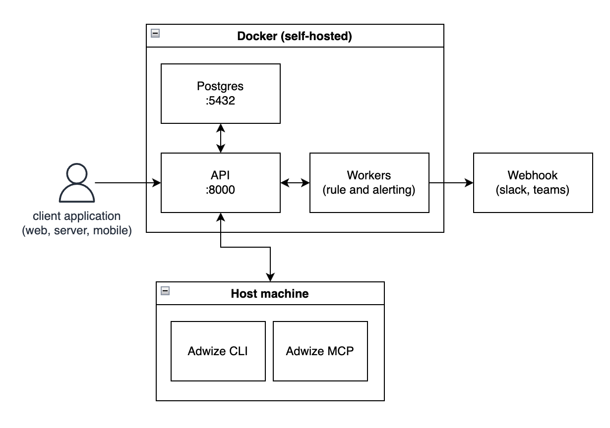

# Adwize

Open-source event monitoring with deterministic rules and webhook alerts. Ingest events from any source, define validation and threshold rules, and get notified instantly via webhooks when something goes wrong.

## Features

- **Event ingestion** — Stream events via REST API with buffered bulk writes
- **Three rule types** — Threshold, Field Validation, and Volume anomaly detection
- **Webhook alerts** — Slack, Teams, or custom webhook notifications with retry
- **CLI** — Full management from the terminal with `adwize` commands
- **MCP Server** — AI-native interface for Cursor, Claude Desktop, and other MCP clients
- **Self-hosted** — Runs entirely on your infrastructure with Docker

## Quick Start

### One-liner install

```bash
curl -fsSL https://raw.githubusercontent.com/Adwize/adwize-oss/main/install.sh | bash
```

Then run the setup wizard:

```bash
cd ~/adwize
adwize setup
```

### Manual setup

```bash
git clone https://github.com/Adwize/adwize-oss.git
cd adwize-oss
cp .env.example .env          # edit with your settings
docker compose up -d --build  # start API, worker, Postgres
uv sync                       # install CLI on your machine
source .venv/bin/activate     # activate to use `adwize` directly
```

The API will be available at `http://localhost:8000` with interactive docs at `/docs`.

> **Note:** `docker compose` runs the backend services. The CLI is a separate tool that runs on your machine and talks to the API. Install it with `uv sync`, then use `adwize <command>` or `uv run adwize <command>`.

## Usage

### Send events

```bash
adwize events send -s web -t page_view -d '{"url": "/pricing", "user_id": "u123"}'
```

Or via API:

```bash
curl -X POST http://localhost:8000/api/v1/events \
  -H "Content-Type: application/json" \
  -d '{
    "source": "web",
    "events": [{"type": "page_view", "data": {"url": "/pricing"}}]
  }'
```

### Create rules

```bash
# Alert if more than 100 errors in 5 minutes
adwize rules create \
  -n "High error rate" \
  -t THRESHOLD \
  -c '{"event_type": "error", "field": "count", "operator": ">", "value": 100, "window_minutes": 5, "severity": "warning"}'

# Alert if purchase events are missing required fields
adwize rules create \
  -n "Purchase validation" \
  -t FIELD_VALIDATION \
  -c '{"event_type": "purchase", "required_fields": ["user_id", "amount", "currency"], "severity": "critical"}'

# Alert if page view volume drops 50% vs yesterday
adwize rules create \
  -n "Traffic drop" \
  -t VOLUME \
  -c '{"event_type": "page_view", "threshold_percent": -50, "current_window_minutes": 60, "severity": "critical"}'
```

### Manage alerts

```bash
adwize alerts list                    # View all alerts
adwize alerts grouped                 # Grouped by rule
adwize alerts resolve <alert-id>      # Mark resolved
adwize alerts test-webhook --url https://hooks.slack.com/services/...
```

### Live tail

```bash
adwize events tail                    # Stream all events
adwize events tail -s web -t error    # Filter by source and type
```

## CLI Reference

```bash
adwize setup                    # Interactive setup wizard
adwize status                   # Health check + summary stats
adwize health                   # Quick health check
adwize up                       # Start services (docker compose up)
adwize down                     # Stop services (docker compose down)
adwize logs [-s api]            # View service logs
adwize mcp                      # Start MCP server (stdio mode)
```

## MCP Server

Connect Adwize to Cursor, Claude Desktop, Windsurf, or any MCP-compatible AI assistant:

```json
{
  "mcpServers": {
    "adwize": {
      "command": "adwize",
      "args": ["mcp"]
    }
  }
}
```

Or without the CLI on PATH:

```json
{
  "mcpServers": {
    "adwize": {
      "command": "uv",
      "args": ["run", "python", "mcp_server/server.py"],
      "cwd": "/path/to/adwize-oss",
      "env": {
        "ADWIZE_API_URL": "http://localhost:8000"
      }
    }
  }
}
```

## HLD



## Configuration

The CLI stores config in `~/.adwize/config.json` (created by `adwize setup`). Environment variables take priority.

| Variable | Default | Description |
|----------|---------|-------------|
| `DB_PASSWORD` | required | PostgreSQL password |
| `DB_NAME` | `adwize` | Database name |
| `DB_USER` | `postgres` | Database user |
| `API_KEY` | _(none)_ | Optional API key for auth |
| `WEBHOOK_URL` | _(none)_ | Default webhook URL for alerts |
| `ADWIZE_API_URL` | `http://localhost:8000` | API base URL (CLI/MCP) |
| `ADWIZE_API_KEY` | _(none)_ | API key for CLI/MCP |

## Development

```bash
uv sync
uv run uvicorn api.main:app --reload
uv run python worker/rule_monitoring.py --once
uv run python mcp_server/server.py
```

## License

Apache License 2.0 — see [LICENSE](LICENSE).
